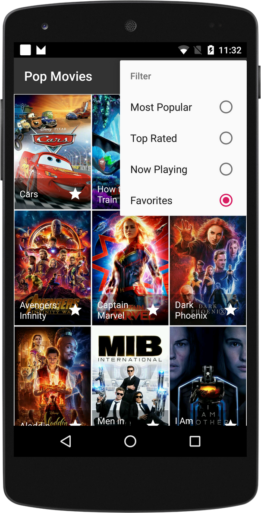
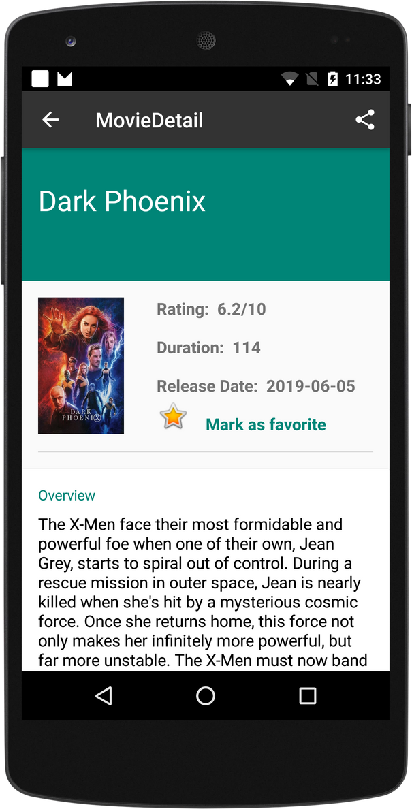

# PopularMovies_2

The purpose of this project is to built an app, to help users discover popular and highly rated movies on the web.
The App displays a scrolling grid of movie thumbnails, launches a details screen whenever a particular movie is selected,
it allows users to save favorites, play trailers, and read users reviews.
This app utilizes core Android user interface components and fetches movie information using themoviedb.org web API.

    
### Getting Started

App uses The Movie Database API.
You have to enter your API key in order to run the app in the gradle.properties.

